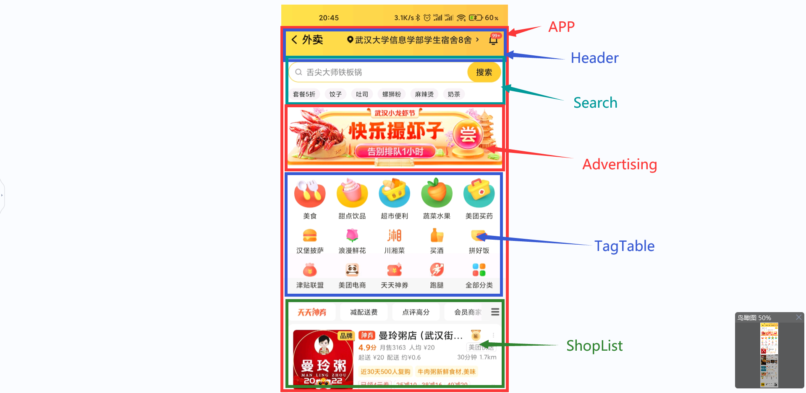
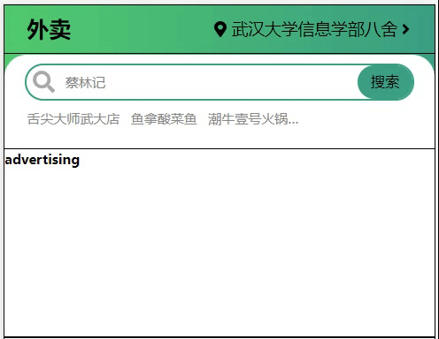

@TOC[从0开始送外卖（三）搭建基本页面]

# 参考


大概做这么个效果。

# 划分组件区域



# 以下仅记录搭建各个子组件遇到的值得记录的问题，不包括所有的代码(而且大多数贴出的代码都是某个时刻的代码)，所有的代码请访问github仓库地址：

[本项目仓库地址：https://github.com/8-liangGoldfish/takeout.git](https://github.com/8-liangGoldfish/takeout.git)

（之后会出一个项目文件结构的说明）

# Header

1. 引入字体库(注意，@fortawesome不是@fontxxx)

   ```shell
   $ npm i --save @fortawesome/fontawesome
   $ npm i --save @fortawesome/react-fontawesome
   $ npm i --save @fortawesome/fontawesome-free-solid
   ```

   app.jsx中需要改动（统一引入要用到的字体资源）

   ```jsx
   //引入fontawesome-react
   import fontawesome from '@fortawesome/fontawesome'
   import { faMapMarkerAlt } from '@fortawesome/fontawesome-free-solid'
   
   fontawesome.library.add(faMapMarkerAlt)
   ```

   

1. flex部分元素靠近主轴尾部，部分在头部布局方式（**外卖**字样在左，其他组件在右）

   （1）Header/index.css
   
   ```css
   .header{
       display: flex;
       justify-content: flex-end;
       align-items: center;
   }
   .header>h3{
       margin-right: auto; /*自动占据剩余宽度*/
   }
   ```
   
   （2）Header/index.jsx
   
   ```jsx
   import {useState,useEffect} from 'react'
   import { FontAwesomeIcon } from '@fortawesome/react-fontawesome'
   import './index.css'
   
   //模拟请求获得的数据
   function getGeoPosition(){
       return new Promise((resolve,reject)=>{
           setTimeout(()=>{
               resolve('武汉大学信息学部八舍')
           },200)
       })
   }
   
   // function getAddressFromSession(sessionID){
   //     return new Promise((resolve,reject)=>{
   //         setTimeout(()=>{
   //             resolve(['武汉大学信息学部八舍','中山大学北校区北苑宾馆'])
   //         },500)
   //     })
   // }
   
   export default function Header(props) {
       const [addr,setAddr] = useState('未获取定位')
       useEffect(()=>{
           getGeoPosition().then(addrText=>{
               setAddr(addrText)
           })
       },[props.user.sessionID])
   
       //通过h5 获取用户地理位置
       var handleGetUserPositionH5 = ()=>{
           getGeoPosition().then(addrText=>{
               setAddr(addrText)
           })
       }
       //通过查询用户历史地址设置(路由跳转)-暂时没做
       var handleGetUserPositionFromSession = function(){
           window.alert("路由跳转")
       }
   
       return (
           <div className='header'>
               <h3>外卖</h3>
               <div>
                   <FontAwesomeIcon icon='map-marker-alt' color='black' onClick={handleGetUserPositionH5}/>
                   <span>{addr}</span>
                   <FontAwesomeIcon icon='angle-right' onClick={handleGetUserPositionFromSession}/>
               </div>
           </div>
       )
   }
   ```
   
1. Header/index.css

   ```css
   .header{
       height: 100%;
       display: flex;
       justify-content: flex-end;
       align-items: center;
       padding: 0 2rem;
   }
   .header>h3{
       font-size: 2rem;
       margin-right: auto;
   }
   .header>div{
       font-size: 1.5rem;
   }
   .header>div>*{
       margin: 0 .2rem;
   }
   ```

1. 注意

   参考图片部分，搜索框是叠在黄色渐变头部区域之上的，也就是有一部分重叠，我用::after实现，见App.css

   ```css
   #header-area{
       height: 5%;
       background: linear-gradient(to right,#2ecc71,#16a085);
   }
   #header-area::after{
       content: "";
       display: block;
       height: 50%;
       width: 100%;
       background: linear-gradient(to right,#2ecc71,#16a085);
   }
   ```

   

1. 效果

   .png)

# Search

主要碰到的有意思的问题:

1. input不是闭合的标签，哪怕是手动闭合，所以给input元素设置::after或::before等伪元素是无效的，因为伪元素是插入选中元素的标签内的，input中并没有伪元素的“位置”。

   解决办法：用一个div.wrapper包裹，伪元素加载div上。

2. 写到这里意识到，user对象需要多个组件使用，在App.jsx中创建user对象的Context会比较方便其他组件访问。

3. 设置FontAwesomeIcon的样式，可以使用它内置的“行内样式”接口。

4. 搜索框中默认的提示内容（即猜用户喜欢的商品自动随机显示在搜索框中）不能用input的defaultValue，那样由于这个提示内容是异步请求的，相当于input挂载后才设置defaultValue，是无效的，而且据测试相当于设置value了。

   而且上述做法还有一个问题，就是用户想要输入文本时，需要先清除搜索框中的内容，且搜索框推荐的内容一般是灰色的，与用户输入最好有所区分。

   因此，做法是使用span绝对定位（使用rem和text-indent）到输入框中，如果用户没输入直接点搜索，就以它为准。此外，推荐内容可以设置刷新间隔。

5. 先上效果图后上代码

   

6. App.jsx改动部分

   ```jsx
   import React,{ Component, createContext } from 'react'
   
   //用户对象因为在大多数组件都要用到，所以使用context，由App的state.user维护其value
   export const UserContext = createContext({sessionID:''})
   
   export class App extends Component{
       state={
           user:{
               sessionID:'1'
           }
       }
       render(){
           const {user} = this.state
           return (
               <UserContext.Provider value={user}>
                   ...
               </UserContext.Provider>
           )
       }
   }
   ```

7. Search/index.jsx+index.css

   ```jsx
   import SearchInput from "./SearchInput"
   import './index.css'
   export default function Search() {
       return (
           <div className="search">
               <SearchInput />
           </div>
       )
   }
   ```

   ```css
   .search{
       height: 100%;
       width: 100%;
       text-align: center;
       padding: 1rem 0;
       background: white;
       border-top-left-radius: 2rem;
       border-top-right-radius: 2rem;
   }
   ```

   

8. Seach/SearchInput/index.jsx+index.css

```jsx
import { FontAwesomeIcon } from '@fortawesome/react-fontawesome'
import { useEffect,useContext,useState } from 'react'
import { UserContext } from '../../App'
import getRandomElement from '../../Common/getRandomElement'
import './index.css'

//FontAwesomeIcom style
const fontSearchStyle={
    position: 'absolute',
    fontSize: '2rem',
    color: '#aaa',
    top: '.5rem',
    left: '2.5rem'
}

//模拟发请求-获取用户喜欢的外卖
function remoteGetUserFavorite(){
    return new Promise((resolve,reject)=>{
        setTimeout(()=>{
            resolve(['舌尖大师武大店','鱼拿酸菜鱼','潮牛壹号火锅米粉','李富贵和刘桂香的伤心牛腩煲'])
        },200)
    })
}

//模拟发请求-获取系统推荐的外卖
function remoteGetSuggestedArray(){
    return new Promise((resolve,reject)=>{
        setTimeout(()=>{
            resolve(['蔡林记','正宗桂林米粉','二食堂山东煎饼','天下第一烤冷面','一点点'])
        },200)
    })
}

export default function SearchInput(props) {
    //用户喜爱的店铺
    const [favors,setFavors] = useState([''])
    //获取系统推荐的店铺
    const [suggestedArray,setSuggestedArray] = useState([''])
    //搜索框中推荐给用户的店铺
    const [suggested,setSuggested] = useState('')

    const { sessionID } = useContext(UserContext)
    
    useEffect(()=>{ //获取用户喜爱店铺的effect
        remoteGetUserFavorite().then(favors=>{
            console.log(favors)
            setFavors(favors)
        })
    },[sessionID])

    useEffect(()=>{ //获取系统推荐的店铺
        remoteGetSuggestedArray().then(res=>{
            setSuggestedArray(res)
        })
    },[sessionID])

    useEffect(()=>{ //搜索框推荐给用户的店铺
        var timer = setInterval(()=>{
            setSuggested(getRandomElement(suggestedArray))
        },2000)
        return ()=>{
            clearInterval(timer)
        }
    })

    return (
        <div>
            <div className='search-wrapper'>
                <FontAwesomeIcon icon='search' style={fontSearchStyle}/>
                <input type='text'/>
                {/* 在搜索框中根据用户喜好 滚动的推荐店铺，input无value时，作为搜索的值 */}
                <span>{suggested}</span>
                <button>搜索</button>
            </div>
            <ul className='favorite-list'>
                {favors.map((v)=>
                    <li key={`favor-${v}`}>{v}</li>
                )}
            </ul>
        </div>
    )
}
```

```css
/*注意: input是不闭合的标签，::after和::before等伪元素只能插入闭合标签中，所以需要wrapper*/
.search-wrapper{
    position: relative;
    height: 3rem;
}

.search-wrapper>input{
    outline:2px solid #16a085;
    width: 90%;
    height: 3rem;
    border-radius: 1.5rem;
    border: 0;
    text-indent: 3.5rem;
}

.search-wrapper>span{
    position: absolute;
    top: 50%;
    left: 0;
    text-indent: 5.5rem;
    /* transition: .5s; */
    transform: translateY(-50%);
    color: gray;
}

.search-wrapper>button{
    position: absolute;
    top: 0;
    right: 5%;
    height: 100%;
    line-height: 3rem;
    background: #16a085;
    border: 0px;
    border-radius: 1.5rem;
    width: 5rem;
    text-align: center;
    font-size: 1.3rem;
}

.search-wrapper::before{
    content: '';
}

.favorite-list{
    display: flex;
    padding: 1rem;
}

.favorite-list>li{
    max-width: 25%;
    margin-left: 1rem;
    white-space: nowrap;
    text-overflow: ellipsis;
    overflow: hidden;
    color: #888;
}

.favorite-list>li:nth-child(n+4){
    display: none;
}
```


# Advertising

1. webpack对不同方式引入图片的打包问题（一）

   **注意：这里踩了一个大坑，就是写jsx的话，虽然写的是\**原生标签，但是不能通过src='path'的方式引入图片，这种方式会导致webpack不识别这个引入的资源，最后是没有打包的，路径也没有转换。

   推荐的做法如下：

   Advertising/index.jsx

   ```jsx
   import React from 'react'
   import adverImg from '../imgs/test.webp'
   
   const imgStyle = {width:'100%',height:'100%'}
   export default function Advertising() {
       console.log(adverImg)
       //在开发环境下是图片路径 如/static/media/test.b139bbf72704bf7f0777.webp，在控制台可以看到这个文件
       //在生产环境中，如果是被转成base64编码，就是base64URL，否则就是生产环境下的图片地址（即打包后的地址）
       return (
           
       )
   }
   ```

   

   在Advertising这个组件中，通过img src引入图片，在下文的TagTable中通过css设置background url引入，两种引入图片的方式都十分常用，但是webpack需要相应的、不同的配置。

   ```shell
   npm i -D file-loader url-loader #url-loader依赖file-loader,所以两个都要装
   ```

   webpack

   ```js
   {
       //img src 图片引入处理
       test: /\.(webp|png|jpg|gif)$/i,
           use: [{
               loader: 'url-loader',
               options:{
                   limit: 5*1024, //5kb以下的图片使用base64编码，减少请求数
                   name: 'imgs/[name].[hash:8].[ext]' //打包到img文件夹下，名称是原图片名.8位hash值.扩展名
               }
           }]
   }
   ```

2. 打包后报错React is not defined

   这个问题是在开发环境中，react 17+ 可以不用每个组件都import React，但是在打包过程中，写的jsx会通过babel调用React.createElement，所以需要引入React。

3. 效果图：

   

